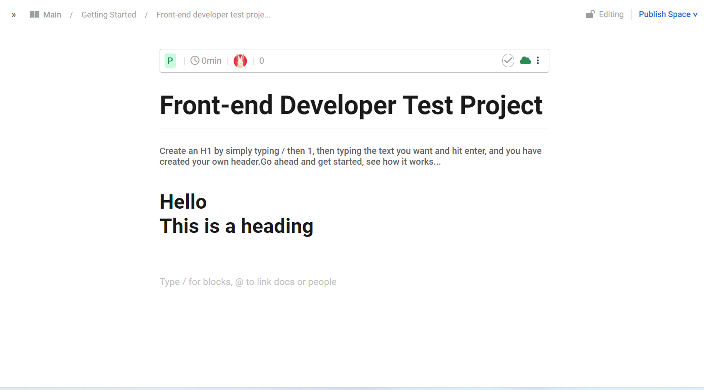

<a name="readme-top"></a>
<div align="center">
  
  <br/>
</div>

# 📗 Table of Contents

- [📗 Table of Contents](#-table-of-contents)
- [📖 \[Frontend-Developer-Test\] ](#-frontend-developer-test-)
  - [🛠 Built With ](#-built-with-)
    - [Tech Stack ](#tech-stack-)
    - [Key Features ](#key-features-)
  - [🚀 Live Demo ](#-live-demo-)
  - [💻 Getting Started ](#-getting-started-)
    - [Prerequisites](#prerequisites)
    - [Setup](#setup)
    - [Install](#install)
    - [Usage](#usage)
    - [Run tests](#run-tests)
    - [Deployment](#deployment)
  - [👥 Authors ](#-authors-)
  - [🔭 Future Features ](#-future-features-)
  - [🤝 Contributing ](#-contributing-)
  - [⭐️ Show your support ](#️-show-your-support-)
  - [🙏 Acknowledgments ](#-acknowledgments-)
  - [📝 License ](#-license-)

<!-- PROJECT DESCRIPTION -->

# 📖 [Frontend-Developer-Test] <a name="about-project"></a>

**[Frontend-Developer-Test]** is An interactive web app that empowers users to input text and instantly transform it into an HTML <h1> heading. Utilizing JavaScript, HTML, and CSS, this app offers a user-friendly interface where individuals can type in their desired text, and upon a specific action (e.g. hitting 'Enter'), the text is rendered as a prominent and stylized header on the screen.

## 🛠 Built With <a name="built-with"></a>

### Tech Stack <a name="tech-stack"></a>

[ ] JavaScript
[ ] CSS
[ ] HTML5
[ ] Jest


### Key Features <a name="key-features"></a>

- **[Input Text:]** Users can input their desired text within a designated text field.
- **[Conversion to heading:]** Upon a triggering action, such as clicking a button or pressing 'Enter', the entered text is dynamically converted into an h1 header
- **[Real-time Rendering:]** Immediate transformation of the entered text into a stylized h1 header visible within the application's interface.

<p align="right">(<a href="#readme-top">back to top</a>)</p>

## 🚀 Live Demo <a name="live-demo"></a>


- [Live Demo Link](https://munyabelden.github.io/Head_text_Test/)

<p align="right">(<a href="#readme-top">back to top</a>)</p>

## 💻 Getting Started <a name="getting-started"></a>

To get a local copy up and running, follow these steps.

### Prerequisites

In order to run this project you need:

<!--
Example command:

```sh
 npm install 
```
 -->

### Setup

Clone this repository to your desired folder:

<!--
Example commands:

```sh
  cd my-folder
  git clone https://munyabelden.github.io/Head_text_Test/
```
--->

### Install

Install this project with:

<!--
Example command:

```sh
  cd header_text_test
  npm install
```
--->

### Usage

To run the project, execute the following command:

<!--
Example command:

```sh
   Go live
```
--->

### Run tests

To run tests, run the following command:

<!--
Example command:

```sh
  npm test
```
--->

### Deployment

You can deploy this project using:

<!--
Example:

```sh
   Upload to github pages or any other of choice
```
 -->

<p align="right">(<a href="#readme-top">back to top</a>)</p>

## 👥 Authors <a name="authors"></a>

👤 **Munyaradzi Belden Mugauri**

- GitHub: [@githubhandle](https://github.com/githubhandle)
- Twitter: [@twitterhandle](https://twitter.com/twitterhandle)
- LinkedIn: [LinkedIn](https://linkedin.com/in/linkedinhandle)

<p align="right">(<a href="#readme-top">back to top</a>)</p>

## 🔭 Future Features <a name="future-features"></a>

- [ ] **[Improved Responsiveness:]** Enhancing the application's responsiveness to ensure seamless functionality across a wide array of devices and screen sizes.
- [ ] **[Custom Text Formatting Options:]** Enabling users to add various text formatting styles beyond the basic h1 headings and well as font styles.
- [ ] **[nIntegration of Data Storage or API:]** Incorporating a data storage solution or integrating an API to empower users to save or store their written content.

<p align="right">(<a href="#readme-top">back to top</a>)</p>

## 🤝 Contributing <a name="contributing"></a>

Contributions, issues, and feature requests are welcome!

Feel free to check the [issues page](https://munyabelden.github.io/Head_text_Test/issues/).

<p align="right">(<a href="#readme-top">back to top</a>)</p>

## ⭐️ Show your support <a name="support"></a>


If you like this project feel free to leave a star and follow for more.

<p align="right">(<a href="#readme-top">back to top</a>)</p>

## 🙏 Acknowledgments <a name="acknowledgements"></a>

I would like to thank Helpjuice for considering me and for this great learning experience
  - [Answer_2]

<p align="right">(<a href="#readme-top">back to top</a>)</p>

## 📝 License <a name="license"></a>

This project is [MIT](https://github.com/Munyabelden/Head_text_Test/blob/main/LICENSE) licensed.

<p align="right">(<a href="#readme-top">back to top</a>)</p>